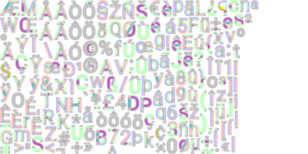

# MSDF font library for LibGDX
Provides lightweight utilities to draw MSDF (multi-channel signed distance field) 
text on LibGDX. See LibGDX's [Distance field fonts][sdf-libgdx] wiki page for more information on
single channel SDF font. It also provides integration with scene2d and AssetManager. 
The library is written in Java but was also designed to be used seemlessly from Kotlin.


[MSDFA font][msdfa] files are used to draw text. This format combines both
multi channel (MSDF) and single channel (SDF) distance fields. 
The MSDF is encoded in 3 channels (RGB) and SDF is encoded in the alpha channel.
Each distance field has its advantages: MSDF is used to accurately draw glyphs with 
sharp corners at any size and SDF is used for shadow effects to keep round corners.
The library can also render normal MSDF and SDF but shadows won't work.

#### Gradle dependency
COMING SOON.

The library is compatible with LibGDX 1.9.10 and up.

## Usage

#### MsdfFont
The shader needs a `MsdfFont` object to work, which is a simple wrapper around BitmapFont.
The `MsdfFont` can be created from an existing BitmapFont or from a *.fnt* file. 
You can also use the AssetManager to load one:
```java
// Load the font with the asset manager.
AssetManager manager = new AssetManager();
manager.setLoader(MsdfFont.class, new MsdfFontLoader(new InternalFileHandleResolver()),
        new MsdfFontLoader.MsdfFontParameter(32f, 5f));
manager.load("roboto.fnt", MsdfFont.class);
manager.finishLoading();
MsdfFont font = manager.get("roboto.png");

// Add the font to a skin.
Skin skin = new Skin()
skin.add("roboto", font);
```
When creating a font, the glyph size in the atlas (the `-s` option used when generating it) 
and the distance range (the `-r` option) must be specified.

#### FontStyle
Font styles can be created by code:
```java
FontStyle fontStyle = new FontStyle()
        .setFontName("roboto")
        .setColor(Color.WHITE)
        .setSize(48f);
```
Or in a skin file:
```libgdxjson
com.maltaisn.msdfgdx.FontStyle: {
    titleFontStyle: {
        fontName: roboto
        color: { hex: #ffffff }
        size: 48
    }
}
```

Here's the list of options in a font style:
- **fontName**: Font name. When used with `MsdfLabel`, the font name is the name of the `MsdfFont` 
  in the skin used to create the label.
- **size**: Text size in pixels.
- **weight**: Text weight (light, bold) between -0.5 and 0.5.
- **color**: Text color
- **allCaps**: All caps text is uppercased automatically when used in `MsdfLabel`.
- **shadowClipped**: Whether shadow should appear behind glyph if glyph color is translucent.
- **shadowColor**: Color of the shadow. Default is transparent.
- **shadowOffset**: Shadow offset in pixels relative to glyph size.
- **shadowSmoothing**: Shadow smoothing between 0 and 0.5.
- **innerShadowColor**: Inner shadow color. Default is transparent.
- **innerShadowRange**: Inner shadow range from 0 to 0.5.

#### MsdfLabel
A subclass of Label used to render MSDF text in scene2d. The label is constructed using a skin instance
and a font style. The skin must contain the shader under the "default" name and the `MsdfFont`.
```java
Skin skin = new Skin();
skin.add("default", new MsdfShader());
skin.add("roboto", new MsdfFont(Gdx.files.internal("roboto.fnt"), 32f, 5f));

FontStyle fontStyle = new FontStyle()
        .setFontName("roboto")
        .setSize(48f);
MsdfLabel label = new MsdfLabel("My text", skin, fontStyle);
stage.addActor(label);
```

Label is the only widget provided by the library. You can make your own MsdfTextField implementation
by applying the code below for drawing text. However, `Label` is the only LibGDX widget to provide
a `setFontScale`, so other widgets may not be able to draw MSDF text by subclassing. 
(see [this issue](https://github.com/libgdx/libgdx/issues/5719))

#### Drawing text
You can also draw text without using MsdfLabel:
```java
MsdfShader shader = skin.get(MsdfShader.class);
MsdfFont font = skin.get("roboto", MsdfFont.class);
BitmapFont bmfont = font.getFont();

batch.setShader(shader);
bmfont.getData().setScale(fontStyle.getSize() / font.getGlyphSize());
shader.updateForFont(font, fontStyle);
bmfont.draw(batch, "My text", 100f, 100f);
batch.setShader(null);
```

## Generating fonts
Unfortunately, generating font files is not as straightforward as generating normal SDF
fonts with Hiero. To generate the fonts, you'll need:
- [msdf-bmfont-xml][msdf-bmfont-xml], a npm package for generating MSDF font texture atlas and `.fnt` file.
  This requires npm installed, then running `npm install msdf-bmfont-xml -g` will install the package globally. 
- Gimp or any image editing tool that can manipulate channels and PNG. This tutorial uses Gimp.
- [The python script][xml-to-fnt] to convert the XML *.fnt* file into the format that LibGDX's BitmapFont uses.
  The script requires Python 3.

Here's the steps to generate the files from a *font.ttf* font file.

1. Generate the SDF font with the command below. You can change the glyph size `-s`, 
the distance range `-r` (the range in px to encode the distance field) and the charset `-i` file.
Here's a [great charset to use][charset] for complete coverage in over 30 languages ([latin-9][charset-wiki]).
    ```text
    msdf-bmfont -f xml -i charset.txt -s 32 -r 5 -t sdf --pot --smart-size %1
    ```
   
2. Rename the generated PNG file to *font-sdf.png*
3. Generate the MSDF font just like the SDF font but changing the `-t` parameter.
    ```text
    msdf-bmfont -f xml -i charset.txt -s 32 -r 5 -t msdf --pot --smart-size %1
    ```
   
4. Run the python script to convert the generated *font.fnt* file to LibGDX's format.
    ```text
    python bmfont_converter.py font.fnt
    ```
  
5. Use Gimp to merge both distance fields:
    - Open the MSDF png file.
    - Add a new layer and copy the SDF png file there.
    - Select SDF layer and click Layer > Transparency > Alpha to Selection.
    - Select MSDF layer and click Layer > Mask > Add layer mask...
    - Initialize layer mask to "Selection" and click Add.
    - Remove the SDF layer.
    - Export image to PNG under *font.png*.
        - "Save color values from transparent pixels" option must be checked.
        - Reduce size by unchecking options like "Save thumbnail" and increasing compression level.
6. Make sure the font atlas file name in *.fnt* file is correct. (The `file=...` attribute)
7. For some reason, the *font.fnt* `base=...` attribute will be too small, so increment it by a few pixels
   until it looks good. I added about 5px for a 32px font for reference.

The result should look like this:



The library can also render normal MSDF and SDF but shadows won't work.

### References
- [msdfgen][msdfgen] by Chlumsky who developed the MSDF technique.
- [msdf-bmfont-xml][msdf-bmfont-xml] by soimy, used to create font texture atlas.
- [SmartEdge's MSDFA font][msdfa], explains the advantages of MSDFA vs MSDF.
- [Font effects shader example][effects-shader] by Chlumsky, used to develop shadow effect.
- [Improved antialiasing shader][better-aa] used by the library.
- [LibGDX's tutorial on distance field fonts][sdf-libgdx] for basic distance field usage.


[msdfa]: http://inter-illusion.com/assets/I2SmartEdgeManual/SmartEdge.html?WhatSDFFormattouse.html
[msdf-bmfont-xml]: https://github.com/soimy/msdf-bmfont-xml
[msdfgen]: https://github.com/Chlumsky/msdfgen
[xml-to-fnt]: utils/bmfont_converter.py
[charset]: utils/charset.txt
[charset-wiki]: https://en.wikipedia.org/wiki/ISO/IEC_8859-15
[sdf-libgdx]: https://github.com/libgdx/libgdx/wiki/Distance-field-fonts
[effects-shader]: https://gist.github.com/Chlumsky/263c960ae0a7df59afc2da4051eb0553
[better-aa]: https://github.com/Chlumsky/msdfgen/issues/36
